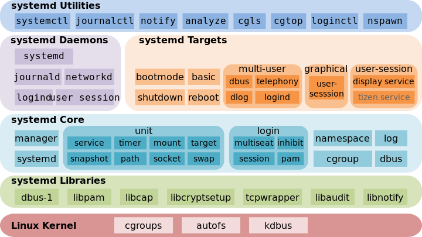

---
tags:
  - linux
  - systemd
---
Что бы кто ни говорил, systemD становится стандартом систем инициализацией в линуксе. И с 80% вероятностью все сервера будут с systemD. Не факт, конечно, есть и личные сервера, на которых может стоять хоть Gentoo, хоть Devuan, хоть NixOS.

Некоторые дистрибутивы хотят даже перейти с загрузчика Grub на systemd-boot! Потому знать, как работать с данной системой инициализации, должен каждый сисадмин и просто программист, ибо сейчас он практически везде.

В этой статье мы разберем — создание сервисов и юнитов, как облегчить работу при помощи systemd, отслеживать состояние системы и управлять ей.

А также напишем небольшой скрипт на Python для автомизации некоторых задач. Приятного чтения, господа линуксоиды и просто пользователи!

Systemd – менеджер системы и сервисов в операционной системе Linux. При разработке eго стремились спроектировать обратно совместимым со скриптами инициализации SysV init и предоставить полезные функции, такие, как параллельный запуск системных сервисов во время загрузки, активацию демонов по требованию, поддержку снепшотов состояния системы и логику управления сервисами, основанную на зависимостях.

SystemD был создан для централизации линукса, и я думаю, это пошло линуксу на пользу. Ведь так стало намного легче администрировать и настраивать сервера. А вы представьте, какой хаос творился бы, если на одном дистрибутиве стоял OpenRC, на другом runit, а не третьем sinit?

Можно долго мусолить тему systemD, но факт остается фактом — эта самая распространенная и популярная система инициализации.

Итак, вот вы находитесь в терминале. Мерцающая белая строка на черном фоне. Давайте начнем с малого, а именно загрузки системы.

Итак, перед появлением рабочего стола происходит следующий алгоритм:

-   Загрузка прошивки (bios или uefi).
-   Загрузчик (чаще всего GRUB). Именно он принимает управление после прошивки (P. S. если используется UEFI, то эта прошивка может напрямую запустить систему, без загрузчика). Загрузчик перемещает ядро и файлы initramfs в память и запускает ядро.
-   Предпоследний момент — монтирование настоящего корневого каталога и запуск `/sbin/init`, то есть системы инициализации.
-   И последний — getty. init запускает для каждого виртуального терминала (обычно их шесть) программу `getty`, которая инициализирует терминалы и запрашивает имя пользователя и пароль. Предоставленные входные данные getty проверяет по файлам `/etc/passwd` и `/etc/shadow`, после чего вызывает логин или запускает менеджер экрана, если таковой имеется.

Мы будем обсуждать предпоследний момент, в частности — систему инициализации. В Linux после загрузки ядра начинается загрузка сервисов, системы, юнитов и других компонентов. За это отвечает специальный процесс с PID 1, который называется init process или процесс инициализации. Он запускается сразу после запуска ядра и завершается с последним вздохом системы.

Вообще, systemD — это не только один процесс. Systemd — подсистема инициализации и управления службами в Linux, фактически вытеснившая в 2010-е годы традиционную подсистему init. Основная особенность — интенсивное распараллеливание запуска служб в процессе загрузки системы, что позволяет существенно ускорить запуск операционной системы. А также это многие другие сервисы, программы и службы для управления системой.

Сюда входит и systemd-resolve (определяет режим работы автоматически в зависимости от того, является ли `/etc/resolv.conf` символической ссылкой на файл заглушки или содержит адреса серверов), и `systemctl` (утилита для управления через командную строку) и многие другие. Из-за этого, кстати, многие считают, что systemD перегружен.

# ❯ История Systemd

Давайте поговорим об истории создания и популяризации systemd в линуксе.
14 лет назад, в далеком 2010 году systemd был разработан Ленартом Поттерингом. Вообще, он довольно известный программист, приложил свою руку к созданию Avahi и PulseAudio. Когда-то работал в Red Hat, но после уволился и перешел в Microsoft.

Эта система инициализации устроила революцию в мире линукса. Сколько жарких споров и холиваров было разведено…

В издании UNIX от 1979 года задач у init — процесса с PID 1 — две, это выполнить при старте `/etc/rc` и создать процессы getty и login. Позже, по мере развития линукса, к задачам стали прибавляться все новые и новые. И в конце концов осталась одна основная задача инициализатора — привести систему в полную готовность к работе, запустить базовые процессы и пользовательское пространство.

Но время неумолимо двигалось вперед. Теперь стали появляться сервисы, с множествами юнитами и скриптами, и при помощи старой SysV init стало неудобно управлять системой. Сервисы в SysV запускались последовательно, так что если захочется контролировать время запуска одного сервиса — придется контролировать все сервисы. А также это было просто медленно. Зависимости между сервисами в SysV были сложными.

Также SysV просто запускал и отключал сервисы, он не имел ни контроля ресурсов, не журналирования, не управления сетью. Также SysV имел множество разрозненных утилит, в отличии от systemD.

И под конец — SysV имел проблемы с надежностью и безопасностью. Пример ненадежности — это небезопасное выключение системы. SysVinit полагается исключительно на загрузочные скрипты, чтобы отмонтировать файловые системы и остановить процессы. Это крайне небезопасно и может вылиться в потерю данных в худших случаях.

Кроме SysV был еще UpStart, разработанный Canonical. Его главная концепция — event-driven подход. Запуск системы — это событие, новое устройство — событие, запуск демона — событие. Процессы могли подписываться на события и запускаться только при явной необходимости. Upstart совместим с sysvinit-скриптами, благодаря этому он был быстро интегрирован во многие дистрибутивы Linux. Тем не менее, после того, как большинство дистрибутивов Linux по тем или иным причинам перешли на systemd, разработка сошла на нет: последний релиз был в 2014-м году, и сегодня Upstart используется только в Chrome OS.

После всего этого Ленарт в своем блоге опубликовал [переосмысление PID 1](https://0pointer.de/blog/projects/systemd.html).

В этом сообщении были сказаны несколько основополагающих вещей современного systemD:
-   Параллельный запуск сервисов, а не поочередный
-   Запускать меньше демонов и сервисов. Если требуется сетевые — то подключаем их, и так далее.
-   Инициализатор должен быть динамичным, реагировать на любые изменения, а после перезапускать или останавливать службы.

В то же время Поттеринг подчёркивает, что эти идеи не новые, и уже известна система с такими возможностями — launchd от Apple, система инициализации в macOS. launchd имеет схожие с Upstart event-driven идеи, но более того, он вобрал в себя задачи других системных сервисов, таких, как cron и inetd.

Другие возможности, которыми должен обладать хороший, по мнению Поттеринга, PID 1:
-   Распараллеливание задач файловых систем. Проверка на ошибки, монтирование и квотирование. Что, если монтировать файловые системы одновременно, или только при доступе к ним?
-   Отслеживание процессов. Одна из задач системы управления сервисами — это мониторинг процессов. Перезапускать, если они упали. Собрать информацию, если они крашнулись. Кроме того, система должна уметь останавливать сервисы, что может быть непросто, если процесс сделал двойной вызов fork().
-   Управление ресурсами сервисов. В идеале, init должен настроить окружение updatedb (обновление БД команды locate) так, чтобы процесс выполнялся только при полном бездействии.
-   Логирование также является важной частью выполнения сервисов. Несмотря на то, что логи — сложная штука, простые сценарии типа вывода в stdout/stderr или обработка логов ядра (dmesg) должны решаться компонентами init.

Подведем итог. После нескольких месяцев борьбы, дистрибутивы стали мало-помалу принимать systemd — Fedora, OpenSuSE. В августе 2012 года Arch Linux переключился также на systemd. Позже systemd начал проникать в другие дистрибутивы — Ubuntu, Debian (2015, в 8 версии). И так творение Поттеринга стало стандартом инициализации в линуксе.

Итак, вернемся к systemd.

# ❯ Анализ Ресурсов Системы

Для анализа системы существует утилита `systemd-analyze`.
Итак, если вы запустите ее, то вы увидите следующее:
```
Startup finished in 2.256s (userspace)
graphical.target reached after 2.217s in userspace.
```

Как мы видим, за 7 секунд загрузилось ядро а за 11 секунд — пользовательское пространство. Всего система загрузилась за 18.5 секунд.

Если вам этого недостаточно, то можно использовать команду `systemd-analyze blame`, которая показывает также время запуска сервисов:

```sh
$ systemd-analyze blame
3.869s dev-sda2.device
2.288s NetworkManager.service
1.606s user@1000.service
1.467s systemd-tmpfiles-setup-dev-early.service
1.445s upower.service
1.215s systemd-udev-trigger.service
 996ms systemd-journal-flush.service
 996ms systemd-journald.service 
 919ms systemd-rfkill.service 
 900ms iio-sensor-proxy.service 
 769ms systemd-tmpfiles-setup.service 
 653ms systemd-logind.service 
 546ms accounts-daemon.service 
 518ms polkit.service 
 459ms systemd-udevd.service 
 445ms systemd-tmpfiles-clean.service 
 425ms systemd-userdbd.service 
 395ms udisks2.service 
 384ms systemd-timesyncd.service
# ...
```

Здесь мы можем увидеть каждый сервис, от Network Manager до демона логина. Это бывает очень полезно при оптимизации системы.

Затем мы также можем просмотреть дерево `time-critical` цепи для конкретной утилиты или вывести список указанных утилит с подкомандой `critical-chain`:

```sh
$ systemd-analyze critical-chain
The time when unit became active or started is printed after the @ character.
The time the unit took to start is printed after the + character.
graphical.target @11.201s
└─multi-user.target @10.795s
  └─systemd-user-sessions.service @10.647s +131ms
    └─network.target @10.613s
	  └─NetworkManager.service @8.317s +2.288s
        └─basic.target @8.189s
          └─dbus-broker.service @7.896s +269ms            
            └─dbus.socket @7.867s
              └─sysinit.target @7.799s
                └─systemd-timesyncd.service @7.414s +384ms
                  └─systemd-tmpfiles-setup.service @6.604s +769ms
                    └─local-fs.target @6.553s
                      └─boot.mount @6.317s +233ms
                        └─dev-sda1.device @6.291s
```

Наконец, давайте рассмотрим еще одну важную подкоманду, которая позволяет создавать графически (svg-формат) детализированные системные службы, которые были запущены.

```sh
$ systemd-analyze plot > boot_analysis.svg
```

Также можно использовать `systemd-analyze` на удаленном сервере при помощи ssh:

```bash
systemd-analyze time -H "username"@"host"
systemd-analyze blame -H "username"@"host"
systemd-analyze critical-chain -H "username"@"host"
```


# ❯ Systemd-ac-power

Утилита, для того чтобы узнать, подключены ли мы к внешнему источнику питания.

```sh
$ systemd-ac-power -v # получаем состояние батареи (подключена ли к источнику питания)
yes
$ systemd-ac-power -v --low # разряжена ли батарея
no
```


# ❯ Systemd-ask-password

Системная утилита для запрашивания пароля через TTY или UI.

```sh
systemd-ask-password [OPTIONS...] MESSAGE
Query the user for a system passphrase, via the TTY or a UI agent.
  -h --help           Show this help     
     --icon=NAME      Icon name
     --id=ID          Query identifier (e.g. cryptsetup:/dev/sda5)
     --keyname=NAME   Kernel key name for caching passwords (e.g. cryptsetup)     
     --credential=NAME                      
             	      Credential name for ImportCredential=, LoadCredential= or                                            SetCredential= credentials
     --timeout=SEC    Timeout in seconds     
     --echo=yes|no|masked
                      Control whether to show password while typing (echo)
  -e --echo           Equivalent to --echo=yes
     --emoji=yes|no|auto
                      Show a lock and key emoji     
     --no-tty         Ask question via agent even on TTY     
     --accept-cached  Accept cached passwords     
     --multiple       List multiple passwords if available     
     --no-output      Do not print password to standard output  
  -n                  Do not suffix password written to standard output with newline
  See the systemd-ask-password(1) man page for details.
```
# ❯ Systemd-cat

Утилита для выполнения процессов с выводом stdout/stderr, подключенный к системному журналу.

```sh
systemd-cat [OPTIONS...] COMMAND ...

Execute process with stdout/stderr connected to the journal.
  -h --help                      Show this help     
     --version                   Show package version
  -t --identifier=STRING         Set syslog identifier
  -p --priority=PRIORITY         Set priority value (0..7)
     --stderr-priority=PRIORITY  Set priority value (0..7) used for stderr
     --level-prefix=BOOL         Control whether level prefix shall be parsed
See the systemd-cat(1) man page for details.
```
# ❯ Systemd-resolve

Специальная команда, которая отвечает за файл `/etc/resolv.conf`. Разрешает доменные имена, адреса и т.д. При неправильном конфиге resolv«а вы не сможете работать в интернете.

```sh
systemd-resolve [OPTIONS...] HOSTNAME|ADDRESS...
systemd-resolve [OPTIONS...] --service [[NAME] TYPE] DOMAIN
systemd-resolve [OPTIONS...] --openpgp EMAIL@DOMAIN...
systemd-resolve [OPTIONS...] --statistics
systemd-resolve [OPTIONS...] --reset-statistics


Resolve domain names, IPv4 and IPv6 addresses, DNS records, and services.
  -h --help                 Show this help
     --version              Show package version
     --no-pager             Do not pipe output into a pager
  -4                        Resolve IPv4 addresses
  -6                        Resolve IPv6 addresses
  -i --interface=INTERFACE  Look on interface
  -p --protocol=PROTO|help  Look via protocol
  -t --type=TYPE|help       Query RR with DNS type
  -c --class=CLASS|help     Query RR with DNS class
     --service              Resolve service (SRV)
     --service-address=BOOL Resolve address for services (default: yes)
     --service-txt=BOOL     Resolve TXT records for services (default: yes)
     --openpgp              Query OpenPGP public key
     --tlsa                 Query TLS public key
     --cname=BOOL           Follow CNAME redirects (default: yes)
     --search=BOOL          Use search domains for single-label names                                                              (default: yes)
     --raw[=payload|packet] Dump the answer as binary data
     --legend=BOOL          Print headers and additional info (default: yes)
     --statistics           Show resolver statistics
     --reset-statistics     Reset resolver statistics
     --status               Show link and server status
     --flush-caches         Flush all local DNS caches
     --reset-server-features
                            Forget learnt DNS server feature levels
     --set-dns=SERVER       Set per-interface DNS server address
     --set-domain=DOMAIN    Set per-interface search domain
     --set-llmnr=MODE       Set per-interface LLMNR mode
     --set-mdns=MODE        Set per-interface MulticastDNS mode
     --set-dnsovertls=MODE  Set per-interface DNS-over-TLS mode
     --set-dnssec=MODE      Set per-interface DNSSEC mode
     --set-nta=DOMAIN       Set per-interface DNSSEC NTA
     --revert               Revert per-interface configuration
See the resolvectl(1) man page for details.
```
# ❯ Другие Systemd-команды

Другие команды и ссылки на команды вы можете видеть ниже. Для просмотра справки запустите с флагом `--help` или посмотрите страницу мануалов (`man`).


# ❯ Компоненты systemD

systemd — набор базовых компонентов Linux-системы. Представляет собой менеджер системы и служб, который выполняется как процесс с PID 1 и запускает остальную часть системы. Основная особенность — интенсивное распараллеливание запуска служб в процессе загрузки системы, что позволяет существенно ускорить запуск операционной системы.

А также systemD очень разросся — он отвечает за несколько базовых вещей — интернет, ядро, журналирование и многое другое.



Systemd приносит концепцию юнитов systemd. Юниты — это некая абстракция, она содержит имя, зависимости, команды, описание, права. Юниты представлены конфигурационными файлами, размещенными в одной из директорий:

-   `/usr/lib/systemd/system/` – юниты из установленных пакетов RPM.
-   `/run/systemd/system/` — юниты, созданные в рантайме. Этот каталог приоритетнее каталога с установленными юнитами из пакетов.
-   `/etc/systemd/system/` — юниты, созданные и управляемые системным администратором. Этот каталог приоритетнее каталога юнитов, созданных в рантайме.

Конфигурационные файлы похожи на ini-файлы:

```ini
[Unit]
Description=Refresh existing PGP keys of archlinux-keyring regularly

[Timer]
OnCalendar=weekly
Persistent=true
RandomizedDelaySec=1week
```

То есть имеются заголовки и параметры. Этот формат очень легкий, понятный.

Юниты делятся на 13 типов, вкратце:
-   service. Основной файл, содержит набор команд и настроек. Системный сервис. Управляет запуском сервисов при помощи определения команд для старта (ExecStart=, ExecStartPre=, ExecStartPost=), условий для запуска (ExecCondition=), рестарта (Restart=, RestartMode=), остановки (ExecStop=, ExecStopPost=) и релоада конфигурации (ExecReload=), а также параметров изоляции процесса при помощи параметров, которые наследуются в слайс сервиса.
-   target. Аналог runlevel в sysvinit. Некая точка в жизненном цикле системы, к которой могут «цепляться» другие юниты. Группа юнитов systemd. Это объединение нескольких сервисов: вы можете таким образом настраивать окружение или совокупность юнитов. Например, если у вас есть несколько демонов, работающих вместе (в моем случае, это элементы control plane в kubernetes и woker plane), вы можете объединить их в один target. Затем, используя команду `systemctl start <name>.target`, вы запускаете все дочерние юниты, входящие в этот target. Это также позволяет вам отслеживать статус выполнения. Также состояние нормального состояния запущенной системы определяется через таргет, например обычная загрузка ОС со всеми сервисами, добавленными в автозагрузку, управляются с помощью multi-user.target.
-   timer. С некоторым интервалом запускает связанный с ним юнит. Аналог задач в cron, однако с поддержкой гораздо более богатого синтаксиса правил дат, который можно посмотреть в `man systemd.time`.
-   mount. Аналог записи в /etc/fstab, даже более того — systemd самостоятельно парсит fstab и динамически создаёт на его основе юнит-файлы. Так, например, через systemctl cat — -.mount можно увидеть, какой юнит-файл создаётся для корневого раздела.
-   automount. То же самое, что и mount, только монтируется «лениво», при первом доступе.
-   socket. Позволяет запустить связанный с ним сервис отложено: systemd при запуске сети начинает слушать сокет, а при первом пакете или подключении запускает сервис, передавая ему объект сокета. Требует дополнительной доработки в сервисе (интеграции с libsystemd или с systemd-socket-proxyd).
-   path. Запускает связанный с ним юнит при доступе или изменения пути, будь то файл или каталог.
-   swap. Особый вариант mount, содержит информацию о файле или разделе, выделенный под swap.
-   slice. Концепция подсистемы управления ресурсами systemd. Подробнее можно почитать в посте Red Hat.
-   scope. Внутренняя часть systemd. Этот юнит создаётся при запуске сервиса и используется для объединения процессов в группы и управления ресурсами сервиса. Процесс, созданный извне.
-   snapshot. У этого юнита, как и у scope, нет конфигурационного файла, он создаётся динамически при выполнении команды systemctl snapshot. Созданный «снимок» будет содержать статус всех юнитов на данный момент, впоследствии на него можно «откатиться» командой systemctl isolate после запуска/остановки сервисов и других юнитов.
-   device. Юнит устройства, такого, как блочное или сетевого устройство. Тесно связан с sysfs/systemd-udevd.
-   nspawn. Юнит systemd-контейнера, о которых чуть позже.

Каждый юнит имеет зависимости, то есть таймер от таргета или наоборот.

Во время загрузки systemd прослушивает сокеты для всех системных сервисов, поддерживает этот тип активации и передает сокеты этим сервисам сразу после старта сервисов. Это позволяет нашей системе инициализации не только запускать сервисы параллельно, но также дает возможность перезапускать сервисы без потери любых отправленных им сообщений, пока сервисы были недоступны. Соответствующий сокет остается доступным и все сообщения выстраиваются в очередь.

Системные сервисы, использующие D–Bus для межпроцессного взаимодействия, могут быть запущены по требованию, когда клиентское приложение пытается связаться с ними.

Системные сервисы, поддерживающие активацию, основанную на устройствах, могут быть запущены, когда определенный тип оборудования подключается или становится доступным.

Системные сервисы могут поддерживать этот вид активации, если изменяется состояние папки или директории.

Система может сохранять состояние всех юнитов и восстанавливать предыдущее состояние системы.

Systemd отслеживает и управляет точками монтирования и автомонтирования.

Агрессивная параллелизация Systemd запускает системные сервисы параллельно из-за использования активации, основанной на сокетах. В комбинации с сервисами, поддерживающими активацию по требованию, параллельная активация значительно уменьшает время загрузки системы.

До активации и деактивации юнитов systemd вычисляет их зависимости, создает временную транзакцию и проверяет целостность этой транзакции. Если транзакция не целостная, systemd автоматически пытается исправить ее и удалить не требующиеся задания из нее до формирования сообщения об ошибке.

SystemD полностью поддерживает скрипты инициализации SysV, как описано в спецификации Linux Standard Base (LSB), что упрощает переход на systemd.

По способу использования сервисные юниты .service напоминают скрипты инициализации. Для просмотра, старта, остановки, перезагрузки, включения или выключения системных сервисов используется команда systemctl. Команды service и chkconfig по-прежнему включены в систему, но только по соображениям совместимости. Пожалуй, одна из самых популярных частей systemd. В journalctl можно посмотреть всё, что произошло с системой: логи sshd, логи ядра и его драйверов, сообщения о крахах, и многое другое.

# ❯ Журналирование И Логирование

Одна из самых важных частей любого администрирования сервера — это просмотр логов. И специально для этого существует демон `journald` и утилита `journalctl`. В журнал system собираются все системные сообщения — от ядра, служб, демонов, приложений. Логирование от systemd может использоваться вместе с syslog, либо использоваться вместо него.

Как я уже сказал, для просмотра логов есть утилита `journalctl`.

## Syslog

Итак, перед началом надо напомнить, что такое `syslog`. Долгое время важным компонентом любого дистрибутива Linux был демон syslog. На протяжении истории было сделано множество реализаций интерфейса syslog, но в целом они были реализованы схожим образом и использовали почти один формат данных на файловой системе.

Целью демона syslog является, как понятно из названия, логирование процессов системы. Демон получает от приложений и сервисов сообщения в относительно свободной форме и сохраняет их на диске. Как правило, единственные метаданные сообщения — это facility (примеры: ядро, почта, сеть, и т.д.) и приоритет, а также timestamp, тег процесса и его PID. Большинство этих полей опционально, и точный синтаксис варьируется от реализации к реализации.

Все файлы журналов, можно отнести к одной из следующих категорий:

-   приложения;
-   события;
-   службы;
-   системный.

Большинство же лог файлов содержится в директории `/var/log`.

-   /var/log/syslog или /var/log/messages содержит глобальный системный журнал, в котором пишутся сообщения с момента запуска системы, от ядра Linux, различных служб, обнаруженных устройствах, сетевых интерфейсов и много другого.
-   /var/log/auth.log или /var/log/secure — информация об авторизации пользователей, включая удачные и неудачные попытки входа в систему, а также задействованные механизмы аутентификации.
-   /var/log/dmesg — драйвера устройств. Одноименной командой можно просмотреть вывод содержимого файла. Размер журнала ограничен, когда файл достигнет своего предела, старые сообщения будут перезаписаны более новыми. Задав ключ --level= можно отфильтровать вывод по критерию значимости.

Поддерживаемые уровни журналирования (приоритеты) в syslog:

-   emerg — система неиспользуемая
-   alert — действие должно быть произведено немедленно
-   crit — условия критичности
-   err — условия ошибок
-   warn — условия предупреждений
-   notice — обычные, но значимые условия
-   info — информационный
-   debug — отладочные сообщения
  

```sh
$ sudo dmesg -l warn
[    0.460817] mtrr: your CPUs had inconsistent variable MTRR settings
[    1.666251] amd_pstate: the _CPC object is not present in SBIOS or ACPI disabled
[    3.087444] i8042: PNP: PS/2 appears to have AUX port disabled, if this is incorrect please boot with i8042.nopnp
```

Также одной из проблем syslog является то, что любой процесс может выдать себя за другой, и syslog не будет ничего проверять. Вторая проблема — нет единого формата записи данных. Анализаторам логов очень тяжело парсить данные логов. Третья проблема — сетевой протокол syslog слишком простой и ограниченный. Четвертая — контроля доступа нет, то есть либо полный доступ, либо полный запрет на чтение логов пользователем. Ну и множество других проблем, которые заставили syslog отойти на второй план.

Сейчас практически на всех серверах используют именно `journald` из systemd. Сообщения проходят аутентификацию, сетевой протокол сделан качественно. То есть сама цель journald — объеденить все технологии журналирования, чтобы не было разрозненных данных.

## Использование Journalctl

Journalctl — это утилита из состава systemd, отвечающая за работу с журналами и демоном journald.

```sh
journalctl [OPTIONS...] [MATCHES...]
Query the journal.Source Options:
     --system                Show the system journal
     --user                  Show the user journal for the current user
  -M --machine=CONTAINER     Operate on local container
  -m --merge                 Show entries from all available journals
  -D --directory=PATH        Show journal files from directory
     --file=PATH             Show journal file
     --root=PATH             Operate on an alternate filesystem root
     --image=PATH            Operate on disk image as filesystem root
     --image-policy=POLICY   Specify disk image dissection policy
     --namespace=NAMESPACE   Show journal data from specified journal namespace
Filtering Options:
  -S --since=DATE            Show entries not older than the specified date
  -U --until=DATE            Show entries not newer than the specified date
  -c --cursor=CURSOR         Show entries starting at the specified cursor
     --after-cursor=CURSOR   Show entries after the specified cursor
     --cursor-file=FILE      Show entries after cursor in FILE and update FILE
  -b --boot[=ID]             Show current boot or the specified boot
  -u --unit=UNIT             Show logs from the specified unit
     --user-unit=UNIT        Show logs from the specified user unit
  -t --identifier=STRING     Show entries with the specified syslog identifier
  -p --priority=RANGE        Show entries within the specified priority range
     --facility=FACILITY...  Show entries with the specified facilities
  -g --grep=PATTERN          Show entries with MESSAGE matching PATTERN
     --case-sensitive[=BOOL] Force case sensitive or insensitive matching
  -k --dmesg                 Show kernel message log from the current boot
  
Output Control Options:
  -o --output=STRING         Change journal output mode (short, short-precise,                                                    short-iso, short-iso-precise, short-full,
                             short-monotonic, short-unix, verbose, export,
                             json, json-pretty, json-sse, json-seq, cat,
                             with-unit)
     --output-fields=LIST    Select fields to print in verbose/export/json modes
  -n --lines[=[+]INTEGER]    Number of journal entries to show
  -r --reverse               Show the newest entries first
     --show-cursor           Print the cursor after all the entries
     --utc                   Express time in Coordinated Universal Time (UTC)
  -x --catalog               Add message explanations where available
     --no-hostname           Suppress output of hostname field
     --no-full               Ellipsize fields
  -a --all                   Show all fields, including long and unprintable
  -f --follow                Follow the journal
     --no-tail               Show all lines, even in follow mode
     --truncate-newline      Truncate entries by first newline character
  -q --quiet                 Do not show info messages and privilege warning
Pager Control Options:
     --no-pager              Do not pipe output into a pager
  -e --pager-end             Immediately jump to the end in the pager
Forward Secure Sealing (FSS) Options:
     --interval=TIME         Time interval for changing the FSS sealing key
     --verify-key=KEY        Specify FSS verification key
     --force                 Override of the FSS key pair with --setup-keys
Commands:
  -h --help                  Show this help text
     --version               Show package version
  -N --fields                List all field names currently used
  -F --field=FIELD           List all values that a specified field takes
     --list-boots            Show terse information about recorded boots
     --disk-usage            Show total disk usage of all journal files
     --vacuum-size=BYTES     Reduce disk usage below specified size
     --vacuum-files=INT      Leave only the specified number of journal files
     --vacuum-time=TIME      Remove journal files older than specified time
     --verify                Verify journal file consistency
     --sync                  Synchronize unwritten journal messages to disk
     --relinquish-var        Stop logging to disk, log to temporary file system
     --smart-relinquish-var  Similar, but NOP if log directory is on root mount
     --flush                 Flush all journal data from /run into /var
     --rotate                Request immediate rotation of the journal files
     --header                Show journal header information
     --list-catalog          Show all message IDs in the catalog
     --dump-catalog          Show entries in the message catalog
     --update-catalog        Update the message catalog database
     --setup-keys            Generate a new FSS key pairSee the journalctl(1) man page for details
```

Journalctl — отличный инструмент для анализа логов, обычно один из первых с которым знакомятся начинающие администраторы linux систем. Встроенные возможности ротации, богатые возможности фильтрации и возможность просматривать логи всех systemd unit-сервисов одним инструментом очень удобны и заметно облегчают работу системным администраторам.

Итак, чтобы просто просмотреть логи, можно просто ввести команду `journalctl`.


Для вывода логов используется небольшая утилита `less` (помогает не выводить сразу все, а самому скроллить текст в терминале). Данная команда выводит все записи из всех журналов, начиная с момента загрузки системы. Время указано по локальному времени в системе, для того чтобы вывести время в формате UTC, надо использовать флаг `--utc`.


Итак, но допустим, мы не хотим читать абсолютно все логи, и нам нужны только ошибки.

Для уровней важности, приняты следующие обозначения:

-   0: emergency (неработоспособность системы)
-   1: alerts (предупреждения, требующие немедленного вмешательства)
-   2: critical (критическое состояние)
-   3: errors (ошибки)
-   4: warning (предупреждения)
-   5: notice (уведомления)
-   6: info (информационные сообщения)
-   7: debug (отладочные сообщения)

Для того, чтобы указать код важности, требуется флаг `-p`. Когда мы, например, будем использовать `journalctl -p 3`, то в журнале будут сообщения с 0, 1, 2 и 3 уровнем (то есть включая предыдущие).


Ниже я представил некоторые базовые флаги для просмотра информации о службах и журналах:

`journalctl -n 100` — показывает первые 100 записей в журнале (вместо 100 можно использовать любое другое число)
`journalctl _SYSTEMD_UNIT=earlyoom.service` — просмотр записей, связанных с юнитом earlyoom.service
`journalctl _COMM=sshd` — показывает все записи, связанные с процессом sshd
`journalctl _PID=1000` — показывает все записи, связанные с PID 1000
`journalctl _UID=1000` — показывает все записи, связанные с UID 1000
`journalctl _GID=1000` — показывает все записи, связанные с GID 1000
`journalctl _HOSTNAME=linux` — показывает все записи, связанные с хостом linux
`journalctl --since 2024-01-01` — показывает все записи, начиная с указанной даты
`journalctl --until 2024-01-01` — показывает все записи, заканчивая указанной датой
`journalctl --since -1h` — показывает все записи за последний час
`journalctl --since -1days` — показывает все записи за последние сутки
`journalctl --vacuum-size=10M` — удаляет записи, пока журнал не станет весом 10МБ.
`journalctl --vacuum-time=1week` — удаляет записи старше 1 недели.
`journalctl --output=short` — показывает записи в компактном виде
`journalctl --output=verbose` — показывает записи в расширенном виде
`journalctl --output=json` — показывает записи в json-формате
`journalctl --verify` — проверяет целостность журнала
`journalctl -xeu "service"` — отображает записи в формате JSON (-x) и единого события (-e) по указанной службе (-u).
`journalctl -feu "service"` — отображает записи в режиме реального времени (-f) и единого события (-e) по указанной службе (-u).
`journalctl --list-boots` — отображеает журналы, которые были созданы при загрузке системы
`journalctl -b 0` — просмотреть журнал с текущего старта системы
`journalctl -b -1` — просмотреть журнал с предыдущего старта системы
`journalctl -k` — просмотр сообщений ядра

## Создание Сервисов

Большинство сервисов хранятся в /etc/systemd/system.

```bash
cd /etc/systemd/system
```

Для примера, давайте создадим службу, которая будет запускать наш скрипт /usr/bin/habr:

```shell
#!/bin/bashecho Hello, Habr!
```

После выдадим права на запуск:

```bash
sudo chmod +x /usr/bin/habr
```

После этого создадим `/etc/systemd/system/habr.service` со следующим содержанием:

```sh
[Unit]
Description=SimpleService
After=default.target
[Service]
ExecStart=/usr/bin/habr
[Install]
WantedBy=default.target
```

После релоадним демоны и включим наш сервис:

```bash
sudo systemctl daemon-reload
sudo systemctl enable habr
```

Разберем файл сервиса:

### Ключи Времени
-   Wants, Requires, Before, After (Ожидает, Требует, Перед, После)
-   WantedBy, RequiresBy (Ожидается цель/служба, Требуется цель/служба)
  
### Параметры Перезапуска Службы
-   no — никогда
-   always — всегда
-   on-success — успешно
-   on-failure — не успешно
-   on-abnormal — не нормальный
-   on-abort — при прерывании
-   on-watchdog — Сторожевой таймер (Watchdog timer) — аппаратно реализованная схема контроля над зависанием системы. Представляет собой таймер, который периодически сбрасывается контролируемой системой. Если сброса не произошло в течение некоторого интервала времени, происходит принудительная перезагрузка системы.

  
### Список Целей
-   default.target — модуль по-умолчанию
-   graphical.target — запуск графической подсистемы
-   multi-user.target — запуск консоли
-   network-online.target — ожидание подключенной сети (используется в Wants)
-   network.target — сеть
-   network-pre.target — запуск до настройки сети (используется в Requires)
-   boot-complete.target — успешная загрузка
  
### Пример Сервиса (SSHD, Ssh daemon)


```ini
[Unit]
Description=OpenSSH server daemon
Documentation=man:sshd(8) man:sshd_config(5)
After=network.target sshd-keygen.target
Wants=sshd-keygen.target
[Service]
Type=notify
EnvironmentFile=-/etc/crypto-policies/back-ends/opensshserver.config
EnvironmentFile=-/etc/sysconfig/sshd
ExecStart=/usr/sbin/sshd -D $OPTIONS $CRYPTO_POLICY
ExecReload=/bin/kill -HUP $MAINPID
KillMode=process
Restart=on-failure
RestartSec=42s
[Install]
WantedBy=multi-user.target
```

Объяснение ниже:

```sh
[Unit]
Description – описание юнита для большего понимания
Documentation – документация по процессу sshd
After – зависимость, т.е. в данном случае запускать юнит только после запуска network.target и sshd-keygen.target
Wants – еще одна зависимость, означает желательно. В примере Wants=sshd-keygen.target, т.е. желательно чтобы было запущено sshd-keygen.target . Желательно, но не обязательно.
[Service]
Type – типы запуска служб. Могут быть:

simple (по умолчанию) – происходит незамедлительный запуск этой службы, с учетом того что процесс не разветвляется (fork). Не используйте simple если пользуетесь очередностью запуска. Одно исключение это активация сокета.
forking – служба считается запущенной после того, после разветвления процесса с завершением родительского процесса. Используется для запуска классических демонов исключая случаи, когда в таком поведении процесса нет необходимости. Также желательно указать PIDFile=, чтобы systemd мог отслеживать основной процесс.
oneshot – удобен для скриптов, которые выполняют одно задание и завершаются. При необходимости можно задать параметр RemainAfterExit=yes, чтобы systemd считал процесс активным даже после его завершения.
notify – идентичен параметру simple, но с оговоркой, что демон пошлет systemd сигнал о своей готовности. Эталонная реализация данного уведомления представлена в libsystemd-daemon.so.
dbus – служба считается находящейся в состоянии готовности, когда указанный параметр BusName появляется в системной шине DBus.
idle – откладывается выполнение двоичного файла службы до момента выполнения всех остальных задач. В остальном поведение аналогично simple.
Далее в разделе Service

EnvironmentFile – файлы переменного окружения
ExecStart – полный путь к исполняемому файлу программы с параметрами запуска
ExecReload – полный пусть к исполняемому файлу программы с параметрами перезапуска программы
KillMode – указывается как будет завершен процесс. В данному случае параметр process говорит о том что будет закрыт только главный процесс
Restart – перезагрузка процесса, параметр on-failure указывает на автоматическую перезагрузку в случае отказа процесса
RestartSec – время ожидания через которое процесс должен перезагрузиться
[Install]
WantedBy – указывает на каком уровне запуска стартует сервис, параметр multi-user.target указывает на запуск в многопользовательском режиме без графики
```


# ❯ Работа С Сервисами Через Systemctl

systemctl — специальная утилита для взаимодействия с сервисами и systemd.

Основные команды я вынес ниже:

-   `systemctl start "служба"` — запуск определенной службы
-   `systemctl stop "служба"` — остановка определенной службы
-   `systemctl restart "служба"` — перезапуск службы
-   `systemctl reload "служба"` — перезагрузка конфига службы
-   `systemctl status "служба"` — статус службы
-   `systemctl enable "service"` — включение автозапуска службы
-   `systemctl disable "service"` — выключение автозапуска службы
-   `systemctl is-enabled "service"` — включен ли автозапуск службы
-   `systemctl poweroff` — выключение системы
-   `systemctl suspend` — перевод системы в спящий режим системы
-   `systemctl hibernate` — гибернация системы
-   `systemctl reboot` — перезагрузка системы
-   `systemctl list-units` — отображает все активные юниты
-   `systemctl list-unit-files` — отображает все доступные юнит-файлы
-   `systemctl show "название юнита"` — отображает подробную информацию об указанном юните
-   `systemctl daemon-reload` — перезагрузка и перечитывание всех конфигов юнитов.
-   `systemctl isolate "системный уровень, таргет"` — переключает систему в указанный системный уровень
-   `systemctl mask "название юнита"` — запрещает запуск данного юнита, маскирует его
-   `systemctl unmask "название юнита"` — разрешает запуск данного юнита
-   `systemctl --failed` — показывает все службы, которые не смогли запуститься из-за ошибки.

  

# ❯ Удаленное Управление Systemd

Системой и менеджером служб systemd на удаленном сервере можно управлять через ssh, благодаря systemctl.

Для этого надо просто использовать флаг `--host`:

```sh
$ systemctl --host root@hostname status nginx.service
```

В команде выше мы проверили статус службы `nginx`.

Благодаря этому флагу мы можем взаимодействовать с системой на удаленном сервере без прямого подключения.

# ❯ Создаем Свой Скрипт Для Работы С Systemd

Небольшой продукт нашей статьи — это скрипт на Python, целью которого является облегчение некоторых задач.

В нашем примере мы создадим всего лишь несколько функций — более подробная функция времени загрузки системы, включение и выключение службы.

Например, можно скомбинировать несколько похожих команд для более быстрого взаимодействия.

Давайте попробуем создать простой скрипт, который будет анализировать время запуска системы.
Итак, давайте создадим виртуальное окружение Python и установим нужные пакеты:

```bash
python3 -m venv venv        # Создаем
source venv/bin/activate    # Активируем
pip3 install click          # Установливаем зависимости
```

Click — это специальная библиотека для создания CLI-приложений на python. Давайте создадим шаблон нашего приложения:

```python
# Импорт нужных нам в будущем библиотек
import os                   # Взаимодействие с ОС
import re                   # Регулярные выражения
import subprocess           # Для запуска процессов
import statistics           # Математически-статические вычисления
import click                # Для CLI приложения

def is_root() -> bool:
    """
        Проверяем, запущен ли скрипт от рута
        :return: True если от рута, False в ином случае
    """    
    return os.getuid() == 0@click.group
def main():
    """
    Группа команд
    """
    pass
if __name__ == "__main__":
    main()
```

Пока что у нас нету никаких команд, так давайте же создадим! Начнем с простого — получение версии systemd.


```python
@click.command
def get_systemd_version() -> str:
    """    Получаем версию systemD    """
    version = ""
    try:
        # Получаем вывод команды systemctl --version и парсим оттуда версию
        text = subprocess.check_output(["systemctl", "--version"], encoding="utf8")
        version = text.split(" ")[1]
    except Exception as ex:        # В случае ошибки
        print(f"Произошла ошибка: {ex}")
        raise ex
    else:        # Если все прошло гладко, возращаем версию
        return version
```

Следующий шаг — это две функции, включение и выключение службы:

```python
@click.command
@click.option("-s", "--service", required=True, help="Service name for disable")
def disable(service: str):
    """
    Выключение службы.
    :param service: Имя службы
    """    
    # Проверяем, от рута ли мы работаем
    if is_root():
        # Если да, то sudo не требуется
        process = subprocess.call(["systemctl", "disable", "--now", service],                                stderr=subprocess.PIPE, stdout=subprocess.PIPE)
    else:
        # В ином случае используем sudo
        process = subprocess.call(["sudo", "systemctl", "disable", "--now", service],                                 stderr=subprocess.PIPE, stdout=subprocess.PIPE)
    if process.return_source != 0:
        # Если команда выполнилась неудачно, то
        print(f"Ошибка: {process.stderr}")
    else:
        # Если все успешно, то
        print(process.stdout)
        
@click.command
@click.option("-s", "--service", required=True, help="Service name for enable")
def enable(service: str):
    """
    Включение службы.    :param service: Имя службы
    """
    # Проверяем, от рута ли мы работаем
    if is_root():
        # Если да, то просто вызываем команду
        process = subprocess.call(["systemctl", "enable", "--now", service],                                stderr=subprocess.PIPE, stdout=subprocess.PIPE)
    else:        # Если нет, то используем команду через sudo
        process = subprocess.call(["sudo", "systemctl", "enable", "--now", service],                                 stderr=subprocess.PIPE, stdout=subprocess.PIPE)
    if process.return_source != 0:        # Если команда выполнилась неудачно, то
	    print(f"Ошибка: {process.stderr}")
    else:        # Если все успешно, то
        print(process.stdout)
```

А теперь займемся последней функцией — получение подробных данных о времени загрузки системы:

```python
@click.commanddef startuptime() -> bool:
    """
        Анализ времени запуска системы и служб
    """
    try:
        # время запуска системы
        text = subprocess.check_output(["systemd-analyze", "blame"], encoding="utf8")
    except Exception as ex:
        return False
    try:
        # время запуска служб
        text2 = subprocess.check_output(["systemd-analyze"], encoding="utf8")
    except Exception as ex:
        return False

    # общее время загрузки служб
    total_time = text2.split("\n")[0].split(" ")[-2]
    times, units, names = [], [], []# списки для времени и названий служб
    for line in text.strip().split("\n"):
        if line:
            # ищем по регулярному выражению время и имя службы
            match = re.match(r"\s*(\d+(?:\.\d+)?)(ms|s)\s+(\S+)", line)
            if match:
                times.append(float(match.group(1)))
                units.append(match.group(2))
                names.append(match.group(3))
    # выводим службы, будет примерно так:
    # 4.071s     -- dev-sda2.device
    # 2.631s     -- iio-sensor-proxy.service
    for time, unit, name in zip(times, units, names):
        startup_ftime = f"{time}{unit}"
        print(f"{startup_ftime:10} -- " \
                        f"{name}")
    # Ищем самую медленную и быструю службу
    fastest_startup_ftime = f"{times[0]}{units[0]}"
    slowest_startup_ftime = f"{times[-1]}{units[-1]}"
    total_service_time = sum(times)
    # время запуска служб
    average = sum(times) / len(times)    # среднее арифмитическое времени запуска служб
    median = statistics.median(times)    # медиана времени запуска служба
    total_unit = set(units)    # название меры времени (ms или s)
    if "s" in total_unit:
        total_speed = total_service_time
    elif "ms" in total_unit:
        total_speed = total_service_time / 1000
    
    print(f"Самая медленная служба ({fastest_startup_ftime}): {names[0]}")
    print(f"Самая быстрая служба ({slowest_startup_ftime}): {names[-1]}")
    print(f"Среднее арифмитическое времени запуска служб: {average:.3f}s")
    print(f"Медиана времени запуска служб: {median:.3f}s")
    print(f"Время загрузки системы (kernel+userspace): {total_time}")
    print(f"Время загрузки сервисов: {total_speed:.3f}{s if s in total_unit else ms}")
    return True
```

Вот и все. Используя этот шаблон, вы можете, например, сделать установщик nginx или postgresql с последующим включением или настройкой службы. Или можно оптимизировать вашу ОС, путем анализа времени запуска системы и служб.

# ❯ Заключение

Знание написания сервисов на systemd и взаимодействия с ним — неотъемлемая часть работы любого системного администратора или даже разработчика. Именно система инициализации отвечает за загрузку всех сервисов, процессов и потоков.

Кроме systemD, существуют другие системы инициализации — такие как OpenRC (от разработчиков Gentoo), runit, dinit. Все они также достойны жить, но вам вряд ли придется администрировать сервер, например с runit. Ибо практически все дистрибутивы основаны на systemd (Fedora, Arch, Gentoo (частично, на выбор можно установить OpenRC или systemD), Debian, RHEL, Astra Linux). И лишь часть дистрибутивов является non-systemd — такие как MX Linux (systemd там не вырезан полностью, а просто отключен), Artix Linux (arch-based), Antix Linux, devuan (debian-based) и частично Gentoo.

Если я где-то что-то неправильно сказал, подправьте меня в комментариях. Прошу не разводить споров насчет того, зло ли systemD или нет.

Когда-то, давным-давно, я уже писал эту статью — но решил добавить нового, полностью обдумать тему систем инициализации и создать новую статью. Надеюсь, вам понравился мой туториал! Благодарю за чтение!

# ❯ Источники Информации

Все полезные ссылки и источники информации я указал ниже:

-   [Хабрапост о создании сервисов и таргетов](https://habr.com/ru/articles/275645/)
-   [Создание простого systemd init](https://newadmin.ru/sozdanie-prostogo-systemd-unit/)
-   [systemd-networkd / ArchWiki](https://wiki.archlinux.org/title/systemd-networkd_(%D0%A0%D1%83%D1%81%D1%81%D0%BA%D0%B8%D0%B9))
-   [Процесс загрузки линукса / ArchWiki](https://wiki.archlinux.org/title/Arch_boot_process_(%D0%A0%D1%83%D1%81%D1%81%D0%BA%D0%B8%D0%B9))
-   [Инициализация системы Linux](https://jtprog.ru/sys-init/)
-   [Хабрапост о 10-летии systemd](https://habr.com/ru/articles/503816/), благодарю автора за такую хорошую статью!
-   [systemd img / wikipedia Shmuel Csaba Otto Traian, CC BY-SA 3.0](https://commons.wikimedia.org/w/index.php?curid=28698339)
-   [systemD / документация редос](https://redos.red-soft.ru/base/manual/utilites/systemd/)
-   [Документация по логам и журналам systemD / Timeweb cloud Docs](https://timeweb.cloud/docs/unix-guides/logging-systemd)
-   [Хабрапост о логах (syslog) в линуксе](https://habr.com/ru/articles/332502/)
-   [Хабрапост об использовании journalctl в линуксе](https://habr.com/ru/companies/ruvds/articles/533918/)
-   [Создание сервиса systemD / Alt Linux Wiki](https://www.altlinux.org/%D0%A1%D0%BE%D0%B7%D0%B4%D0%B0%D0%BD%D0%B8%D0%B5_%D1%81%D0%B5%D1%80%D0%B2%D0%B8%D1%81%D0%B0_systemd)

  

___


## Читайте Также:

-   ➤ [Фантастически быстрый деплой веб-приложения](https://habr.com/ru/companies/timeweb/articles/812413/)
-   ➤ [Деплой .NET приложений для самых маленьких](https://habr.com/ru/companies/timeweb/articles/821555/)
-   ➤ [Учимся летать: симуляция эволюции на Rust](https://habr.com/ru/companies/timeweb/articles/823676/)
-   ➤ [Темные тропы ностальгии: Aliens versus Predator 2](https://habr.com/ru/companies/timeweb/articles/825562/)
-   ➤ [Конрад Цузе — программист, обогнавший время](https://habr.com/ru/companies/timeweb/articles/823346/)

  

> [**Новости, обзоры продуктов и конкурсы от команды Timeweb.Cloud — в нашем Telegram-канале**](https://t.me/timewebru) **↩**


[](https://timeweb.cloud/?i=106909)