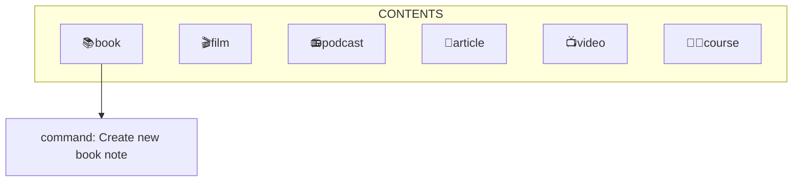

---
cssclasses:
  - wide-85
---

```mermaid

flowchart TD
	subgraph CONTENTS
		    book["📚book"]
		    film["🎬film"]
		    podcast["📻podcast"]
		    article["🧾article"]
		    video["📺video"]
		    course["🧑‍🏫course"]
		end

book --> book1["command: Create new book note"]

```

