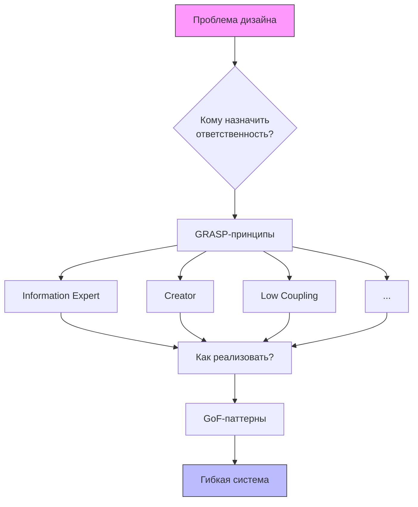

---
tags:
  - АрхитектураПО
  - python
---
# Подробный разбор принципов GRASP с примерами на Python
*Крэг Ларман, 9 принципов для грамотного ООП-дизайна*

---

## Связь принципов GRASP с другими концепциями
**GRASP vs GoF-паттерны**  
GRASP отвечает на вопрос *«Кому назначить ответственность?»*, а GoF-паттерны дают готовые решения *«Как реализовать эту ответственность?»*.

**GRASP vs SOLID**  
Оба набора принципов направлены на создание гибкого кода:
- **GRASP** фокусируется на распределении обязанностей
- **SOLID** решает проблемы проектирования классов и зависимостей

---

## 1. Information Expert (Информационный эксперт)
**Суть**: Назначайте ответственность классу, который обладает максимумом необходимой информации для её выполнения.

**Пример**:
```python
class ShoppingCart:
    def __init__(self):
        self.items = []

    def calculate_total(self):
        return sum(item.price * item.quantity for item in self.items)

class Item:
    def __init__(self, name, price, quantity):
        self.name = name
        self.price = price
        self.quantity = quantity

# Использование
cart = ShoppingCart()
cart.items.append(Item("Book", 20, 2))
cart.items.append(Item("Pen", 5, 3))
print(cart.calculate_total())  # 55
```

**Связь с GoF**:
- **Composite**: Для древовидных структур
- **Chain of Responsibility**: Для поэтапной обработки

**Связь с SOLID** (SRP + LSP):
```python
class Order:
    def __init__(self, items):
        self.items = items

    def total(self):
        return sum(item.price * item.quantity for item in self.items)
```

---

## 2. Creator (Создатель)
**Суть**: Класс `A` должен создавать объекты класса `B`, если:
- `A` содержит или агрегирует `B`
- `A` использует `B` напрямую
- `A` владеет данными для инициализации `B`

**Пример**:
```python
class Library:
    def __init__(self):
        self.books = []

    def add_book(self, title, author):
        self.books.append(Book(title, author))

class Book:
    def __init__(self, title, author):
        self.title = title
        self.author = author

lib = Library()
lib.add_book("Clean Code", "Robert Martin")
```

**Связь с GoF**:
- **Factory Method**: `add_book` как фабрика
- **Singleton**: Единственный источник создания объектов

**Связь с SOLID** (DIP):
```python
class OrderFactory:
    def create_order(self, items):
        order = Order()
        for item_data in items:
            order.add_item(item_data['product'], item_data['quantity'])
        return order
```

---

## 3. Low Coupling (Слабое зацепление)
**Суть**: Минимизируйте зависимости между классами для упрощения изменений.

**Пример**:
```python
from abc import ABC, abstractmethod

class Database(ABC):
    @abstractmethod
    def save_user(self, user): ...

class PostgreSQL(Database):
    def save_user(self, user):
        print(f"Saving {user} to PostgreSQL")

class UserService:
    def __init__(self, db: Database):
        self.db = db
        
    def register(self, user):
        self.db.save_user(user)
```

**Связь с GoF**:
- **Strategy**: Взаимозаменяемые алгоритмы
- **Adapter**: Унификация интерфейсов

**Связь с SOLID** (DIP + ISP):
```python
class PaymentGateway(ABC):
    @abstractmethod
    def pay(self, amount): ...
```

---

## 4. High Cohesion (Высокая связность)
**Суть**: Класс должен решать одну четкую задачу.

**Пример**:
```python
class ReportGenerator:
    def generate(self): ...

class EmailService:
    def send(self): ...

# Антипример
class ReportManager:
    def generate_report(self): ...
    def send_email(self): ...  # Нарушение связности
```

**Связь с GoF**:
- **Facade**: Упрощенный интерфейс для сложных систем
- **Command**: Инкапсуляция действий

**Связь с SOLID** (SRP):
```python
class ReportGenerator:
    def generate(self, data): ...

class EmailService:
    def send(self, recipient, message): ...
```

---

## 5. Controller (Контроллер)
**Суть**: Используйте отдельный класс для обработки системных событий.

**Пример**:
```python
class PaymentController:
    def process_payment(self, request):
        if not self.validate_request(request):
            raise ValueError("Invalid request")
        
        payment = Payment.create(request.amount)
        result = payment.execute()
        
        logger = PaymentLogger()
        logger.log(result)
        
        return result

class Payment:
    @classmethod
    def create(cls, amount):
        return cls(amount)
    
    def __init__(self, amount):
        self.amount = amount

    def execute(self):
        print(f"Processing payment: ${self.amount}")
        return True
```

**Связь с GoF**:
- **Command**: Инкапсуляция запросов
- **Mediator**: Координация взаимодействий

**Связь с SOLID** (OCP):
```python
class PaymentController:
    def process(self, payment: PaymentGateway):
        payment.pay(100)  # Расширяемость без изменений
```

---

## 6. Polymorphism (Полиморфизм)
**Суть**: Используйте интерфейсы для обработки разных типов объектов.

**Пример**:
```python
class Shape:
    def area(self): raise NotImplementedError

class Circle(Shape):
    def __init__(self, radius):
        self.radius = radius

    def area(self):
        return 3.14 * self.radius ** 2

shapes = [Circle(5), Square(4)]
print(sum(shape.area() for shape in shapes))
```

**Связь с GoF**:
- **Strategy**: Специфичное поведение для объектов
- **State**: Изменение поведения в зависимости от состояния

**Связь с SOLID** (LSP):
```python
class Bird:
    def fly(self): ...

class Sparrow(Bird):  # Корректная замена
    def fly(self): print("Flying")
```

---

## 7. Pure Fabrication (Чистая выдумка)
**Суть**: Создавайте "искусственные" классы для упрощения системы.

**Пример**:
```python
class WeatherAPIClient:
    def get_forecast(self, city):
        try:
            return {"city": city, "temp": 25} if city == "Moscow" else {}
        except Exception as e:
            return {"error": str(e)}

class WeatherService:
    def __init__(self, api_client):
        self.api = api_client

    def show_forecast(self, city):
        data = self.api.get_forecast(city)
        print(f"Temperature: {data.get('temp', 'N/A')}°C")
```

**Связь с GoF**:
- **Adapter**: Адаптация внешних интерфейсов
- **Proxy**: Контроль доступа и кэширование

**Связь с SOLID** (ISP):
```python
class JSONParser:
    def parse(self, data): ...

class XMLParser:
    def parse(self, data): ...
```

---

## 8. Indirection (Посредник)
**Суть**: Вводите промежуточные объекты для устранения прямых связей.

**Пример**:
```python
class EventBus:
    def __init__(self):
        self.subscribers = []

    def subscribe(self, handler):
        self.subscribers.append(handler)

    def publish(self, event):
        for handler in self.subscribers:
            handler(event)

class Logger:
    def log_event(self, event):
        print(f"Log: {event}")

bus = EventBus()
bus.subscribe(Logger().log_event)
bus.publish("User logged in")
```

**Связь с GoF**:
- **Observer**: Механизм подписки/уведомления
- **Mediator**: Централизация взаимодействий

**Связь с SOLID** (DIP):
```python
bus.subscribe(Logger().log)  # Зависимость через абстракцию
```

---

## 9. Protected Variations (Защита от изменений)
**Суть**: Изолируйте компоненты от изменений через абстракции.

**Пример**:
```python
class PaymentGateway(ABC):
    @abstractmethod
    def pay(self, amount): ...

class StripeGateway(PaymentGateway):
    def pay(self, amount):
        print(f"Paying ${amount} via Stripe")

class Order:
    def __init__(self, gateway: PaymentGateway):
        self.gateway = gateway

    def checkout(self, amount):
        self.gateway.pay(amount)

# Антипример
class BadOrder:
    def checkout(self, amount):
        stripe = StripeGateway()  # Жесткая зависимость
        stripe.pay(amount)
```

**Связь с GoF**:
- **Bridge**: Разделение абстракции и реализации
- **Strategy**: Взаимозаменяемые алгоритмы

**Связь с SOLID** (OCP + DIP):
```python
class DataExporter(ABC):
    @abstractmethod
    def export(self, data): ...
```

---

## Советы по применению GRASP
1. **Комбинируйте принципы**: Low Coupling и High Cohesion работают вместе
2. **Анализируйте контекст**: Выбор принципа зависит от конкретной задачи
3. **Избегайте слепого следования**: Принципы - ориентиры, а не догмы
4. **Эволюционный подход**: Начинайте с Information Expert и Creator

**Пример комплексного применения**:
```python
class Order:
    def __init__(self):
        self.items = []

    def add_item(self, product, quantity):
        self.items.append(OrderItem(product, quantity))  # Creator

    def total(self):  # Information Expert
        return sum(item.cost() for item in self.items)
    
    def checkout(self, gateway: PaymentGateway):  # Protected Variations
        gateway.pay(self.total())

class OrderItem:
    def __init__(self, product, quantity):
        self.product = product
        self.quantity = quantity

    def cost(self):
        return self.product.price * self.quantity
```

---

## Влияние GRASP на качество кода
| Принцип              | Cohesion | Coupling | Гибкость |
|----------------------|----------|----------|----------|
| Information Expert   | ↑↑↑      | ↓        | ↑↑       |
| Creator              | ↑        | ↓↓       | ↑        |
| Low Coupling         | ↑        | ↓↓↓      | ↑↑↑      |
| High Cohesion        | ↑↑↑      | -        | ↑↑       |
| Protected Variations | ↑↑       | ↓↓       | ↑↑↑      |
| Polymorphism         | ↑        | ↓↓       | ↑↑↑      |
| Pure Fabrication     | ↑↑       | ↓        | ↑↑       |
| Indirection          | -        | ↓↓↓      | ↑↑       |

---

## Связь GRASP с GoF и SOLID
| GRASP-принцип       | GoF-паттерны                          | SOLID-принципы       |
|---------------------|---------------------------------------|----------------------|
| Information Expert  | Composite, Chain of Responsibility    | SRP, LSP            |
| Creator             | Factory Method, Singleton             | SRP, DIP            |
| Low Coupling        | Strategy, Adapter                     | DIP, ISP, OCP       |
| High Cohesion       | Facade, Command                       | SRP                 |
| Controller          | Command, Mediator                     | OCP                 |
| Polymorphism        | Strategy, State                       | LSP, OCP            |
| Pure Fabrication    | Adapter, Proxy                        | ISP, DIP            |
| Indirection         | Observer, Mediator                    | DIP                 |
| Protected Variations| Bridge, Strategy                      | OCP, DIP            |

---

## Выводы
1. **GRASP + GoF + SOLID = Мощный дизайн**  
   Комбинация этих подходов создает системы, устойчивые к изменениям.

2. **Фокус на распределении обязанностей**  
   GRASP отвечает на ключевой вопрос ООП: "Кому должна принадлежать ответственность?"

3. **Практическое применение**  
   Начинайте с простых принципов (Information Expert, Creator), затем добавляйте Protected Variations по мере роста системы.

4. **Баланс - ключ к успеху**  
   Избыточное применение Pure Fabrication может усложнить систему. Ищите баланс между гибкостью и простотой.



GRASP обеспечивает фундамент для создания поддерживаемых ООП-систем, особенно при разработке сложных бизнес-приложений на Python.