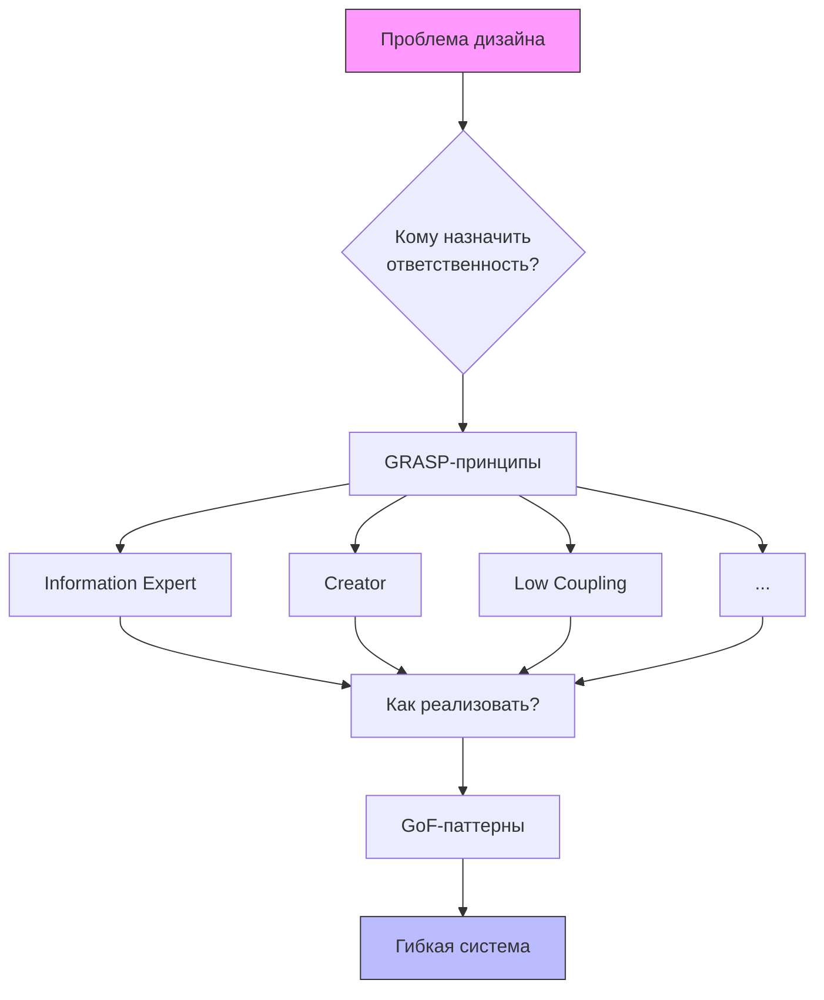

---
tags:
  - АрхитектураПО
  - python
---
# Подробный Разбор Принципов GRASP С Примерами На Python
*Крэг Ларман, 9 принципов для грамотного ООП-дизайна*

---

## Связь Принципов GRASP С Другими Концепциями
**GRASP vs GoF-паттерны**
GRASP отвечает на вопрос *«Кому назначить ответственность?»*, а GoF-паттерны дают готовые решения *«Как реализовать эту ответственность?»*.

**GRASP vs [[SOLID принципы|SOLID]]**
Оба набора принципов направлены на создание гибкого кода:
- **GRASP** фокусируется на распределении обязанностей
- **SOLID** решает проблемы проектирования классов и зависимостей

---
## Анализ Взаимосвязей GRASP, SOLID И GoF Паттернов

### 1. Information Expert (Информационный эксперт)
**GoF паттерны**:
- **Composite (Компоновщик)**: Для иерархических структур
- **Chain of Responsibility (Цепочка обязанностей)**: Для поэтапной обработки

**Пример с Composite**:
```python
class ProductComponent:  # GoF Composite
    def get_price(self):
        raise NotImplementedError

class Product(ProductComponent):
    def __init__(self, name, price):
        self.name = name
        self.price = price
    
    def get_price(self):
        return self.price

class ProductBundle(ProductComponent):
    def __init__(self):
        self.products = []
    
    def add_product(self, product):
        self.products.append(product)
    
    # Information Expert: Бандл знает свои продукты
    def get_price(self):  # GRASP Information Expert
        return sum(p.get_price() for p in self.products)

# Использование
bundle = ProductBundle()
bundle.add_product(Product("Laptop", 1000))
bundle.add_product(Product("Mouse", 50))
print(f"Bundle price: ${bundle.get_price()}")
```

**Анализ**:
- **GRASP**: Information Expert - `ProductBundle` вычисляет стоимость как эксперт
- **SOLID**: SRP - каждый класс имеет одну ответственность
- **GoF**: Composite - иерархия продуктов и наборов

### 2. Creator (Создатель) + Factory Method
**GoF паттерны**:
- **Factory Method (Фабричный метод)**
- **Abstract Factory (Абстрактная фабрика)**

```python
from abc import ABC, abstractmethod

# GoF Abstract Factory
class UIFactory(ABC):
    @abstractmethod
    def create_button(self): pass
    
    @abstractmethod
    def create_checkbox(self): pass

# Конкретная фабрика
class WindowsUIFactory(UIFactory):
    # Creator: Фабрика создает элементы
    def create_button(self):
        return WindowsButton()
    
    def create_checkbox(self):
        return WindowsCheckbox()

# Продукты
class Button(ABC):  # GRASP Polymorphism
    @abstractmethod
    def render(self): pass

class WindowsButton(Button):
    def render(self):
        print("Rendering Windows button")

class Checkbox(ABC):
    @abstractmethod
    def render(self): pass

class WindowsCheckbox(Checkbox):
    def render(self):
        print("Rendering Windows checkbox")

# SOLID DIP: Клиент зависит от абстракций
def create_ui(factory: UIFactory):
    button = factory.create_button()
    checkbox = factory.create_checkbox()
    button.render()
    checkbox.render()

# Использование
create_ui(WindowsUIFactory())
```

**Анализ**:
- **GRASP**: Creator - фабрика создает объекты
- **SOLID**: DIP - зависимости от абстракций
- **GoF**: Abstract Factory - создание семейств объектов

### 3. Low Coupling (Слабое зацепление) + Strategy
**GoF паттерны**:
- **Strategy (Стратегия)**
- **Adapter (Адаптер)**

```python
from abc import ABC, abstractmethod

# GoF Strategy
class SortingStrategy(ABC):
    @abstractmethod
    def sort(self, data): pass

class QuickSort(SortingStrategy):
    def sort(self, data):
        print("Sorting with QuickSort")
        return sorted(data)

class MergeSort(SortingStrategy):
    def sort(self, data):
        print("Sorting with MergeSort")
        return sorted(data)  # Упрощенная реализация

# Контекст с низкой связностью
class Sorter:
    def __init__(self, strategy: SortingStrategy = None):
        self.strategy = strategy or QuickSort()  # Значение по умолчанию
    
    # SOLID OCP: Можно менять стратегию
    def set_strategy(self, strategy: SortingStrategy):
        self.strategy = strategy
    
    def perform_sort(self, data):
        return self.strategy.sort(data)

# Использование
data = [5, 2, 8, 1, 9]
sorter = Sorter()
sorter.perform_sort(data)  # QuickSort

sorter.set_strategy(MergeSort())
sorter.perform_sort(data)  # MergeSort
```

**Анализ**:
- **GRASP**: Low Coupling - контекст не зависит от конкретных стратегий
- **SOLID**: OCP - легко добавлять новые стратегии
- **GoF**: Strategy - инкапсуляция алгоритмов

### 4. High Cohesion (Высокая связность) + Facade
**GoF паттерны**:
- **Facade (Фасад)**
- **Command (Команда)**

```python
# Слабо связанные классы с высокой связностью
class CPU:
    def process(self):
        print("Processing data")

class Memory:
    def load(self):
        print("Loading data to memory")

class HardDrive:
    def read(self):
        print("Reading data from disk")

# GoF Facade
class ComputerFacade:
    def __init__(self):
        self.cpu = CPU()
        self.memory = Memory()
        self.hd = HardDrive()
    
    # Высокая связность: единая точка входа
    def start(self):
        self.hd.read()
        self.memory.load()
        self.cpu.process()

# SOLID SRP: Фасад предоставляет простой интерфейс
def run_computer():
    computer = ComputerFacade()
    computer.start()

run_computer()
```

**Анализ**:
- **GRASP**: High Cohesion - каждый класс имеет четкую зону ответственности
- **SOLID**: SRP - классы решают одну задачу
- **GoF**: Facade - упрощенный интерфейс к сложной системе

### 5. Controller (Контроллер) + Command
**GoF паттерны**:
- **Command (Команда)**
- **Mediator (Посредник)**

```python
from abc import ABC, abstractmethod

# GoF Command
class Command(ABC):
    @abstractmethod
    def execute(self): pass

class LightOnCommand(Command):
    def __init__(self, light):
        self.light = light
    
    def execute(self):
        self.light.turn_on()

class Light:
    def turn_on(self):
        print("Light is ON")

# GRASP Controller
class RemoteControl:
    def __init__(self):
        self.command = None
    
    # SOLID DIP: Зависимость от абстракции Command
    def set_command(self, command: Command):
        self.command = command
    
    def press_button(self):
        if self.command:
            self.command.execute()

# Использование
light = Light()
light_on = LightOnCommand(light)

remote = RemoteControl()
remote.set_command(light_on)
remote.press_button()  # Light is ON
```

**Анализ**:
- **GRASP**: Controller - `RemoteControl` управляет выполнением
- **SOLID**: DIP - зависимость от абстракции Command
- **GoF**: Command - инкапсуляция запросов

### 6. Polymorphism (Полиморфизм) + State
**GoF паттерны**:
- **State (Состояние)**
- **Strategy (Стратегия)**

```python
from abc import ABC, abstractmethod

# GoF State
class OrderState(ABC):
    @abstractmethod
    def next(self, order): pass

class NewOrderState(OrderState):
    def next(self, order):
        print("Processing new order")
        order.state = ProcessingState()

class ProcessingState(OrderState):
    def next(self, order):
        print("Shipping order")
        order.state = ShippedState()

class ShippedState(OrderState):
    def next(self, order):
        print("Order delivered")
        order.state = DeliveredState()

class Order:
    def __init__(self):
        self.state = NewOrderState()  # GRASP Creator
    
    # GRASP Polymorphism
    def next_state(self):
        self.state.next(self)

# SOLID LSP: Состояния взаимозаменяемы
order = Order()
order.next_state()  # Processing
order.next_state()  # Shipped
order.next_state()  # Delivered
```

**Анализ**:
- **GRASP**: Polymorphism - разные состояния реализуют общий интерфейс
- **SOLID**: LSP - состояния могут заменять друг друга
- **GoF**: State - изменение поведения при изменении состояния

### 7. Pure Fabrication (Чистая выдумка) + Adapter
**GoF паттерны**:
- **Adapter (Адаптер)**
- **Proxy (Заместитель)**

```python
# Внешний сервис с несовместимым интерфейсом
class LegacyWeatherService:
    def get_weather_data(self, city, country):
        return f"Weather for {city}, {country}: 25°C"

# GRASP Pure Fabrication
class WeatherAdapter:
    def __init__(self, legacy_service):
        self.legacy_service = legacy_service
    
    # GoF Adapter: Адаптация интерфейса
    def get_forecast(self, location):
        city, country = location.split(",")
        return self.legacy_service.get_weather_data(city.strip(), country.strip())

# SOLID ISP: Узкоспециализированный интерфейс
class WeatherClient:
    def __init__(self, adapter):
        self.adapter = adapter
    
    def show_weather(self, location):
        print(self.adapter.get_forecast(location))

# Использование
legacy = LegacyWeatherService()
adapter = WeatherAdapter(legacy)
client = WeatherClient(adapter)
client.show_weather("New York, USA")
```

**Анализ**:
- **GRASP**: Pure Fabrication - адаптер не относится к предметной области
- **SOLID**: ISP - клиент работает с узким интерфейсом
- **GoF**: Adapter - преобразование интерфейсов

### 8. Indirection (Посредник) + Observer
**GoF паттерны**:
- **Observer (Наблюдатель)**
- **Mediator (Посредник)**

```python
# GoF Observer
class EventManager:
    def __init__(self):
        self.subscribers = []
    
    def subscribe(self, subscriber):
        self.subscribers.append(subscriber)
    
    def notify(self, event):
        for subscriber in self.subscribers:
            subscriber.update(event)

class Subscriber(ABC):
    @abstractmethod
    def update(self, event): pass

class Logger(Subscriber):
    def update(self, event):
        print(f"Logging event: {event}")

class EmailNotifier(Subscriber):
    def update(self, event):
        print(f"Sending email for: {event}")

# GRASP Controller + Indirection
class OrderSystem:
    def __init__(self):
        self.event_manager = EventManager()  # Indirection
        self.event_manager.subscribe(Logger())
        self.event_manager.subscribe(EmailNotifier())
    
    def create_order(self, order_data):
        print("Creating order...")
        # Логика создания заказа
        self.event_manager.notify("ORDER_CREATED")

# SOLID OCP: Легко добавлять новых подписчиков
system = OrderSystem()
system.create_order({"items": [1, 2, 3]})
```

**Анализ**:
- **GRASP**: Indirection - `EventManager` уменьшает связность
- **SOLID**: OCP - новые подписчики без изменения издателя
- **GoF**: Observer - механизм подписки/уведомления

### 9. Protected Variations (Защита От изменений) + Bridge
**GoF паттерны**:
- **Bridge (Мост)**
- **Strategy (Стратегия)**

```python
from abc import ABC, abstractmethod

# GoF Bridge
class Renderer(ABC):
    @abstractmethod
    def render_circle(self, radius): pass

class VectorRenderer(Renderer):
    def render_circle(self, radius):
        print(f"Drawing circle of radius {radius} with vectors")

class RasterRenderer(Renderer):
    def render_circle(self, radius):
        print(f"Drawing circle of radius {radius} with pixels")

# Абстракция
class Shape(ABC):
    def __init__(self, renderer):
        self.renderer = renderer  # SOLID DIP
    
    @abstractmethod
    def draw(self): pass

class Circle(Shape):
    def __init__(self, renderer, radius):
        super().__init__(renderer)
        self.radius = radius
    
    # GRASP Protected Variations
    def draw(self):
        self.renderer.render_circle(self.radius)

# Использование
vector_circle = Circle(VectorRenderer(), 5)
vector_circle.draw()  # Drawing circle with vectors

raster_circle = Circle(RasterRenderer(), 10)
raster_circle.draw()  # Drawing circle with pixels
```

**Анализ**:
- **GRASP**: Protected Variations - изоляция от изменений в реализации
- **SOLID**: DIP - абстракции не зависят от деталей
- **GoF**: Bridge - разделение абстракции и реализации

## Сводная Таблица: GRASP, SOLID И GoF Шаблоны

| GRASP Принцип            | SOLID Принципы                                                                                                                                                                                              | GoF Паттерны                                                                                   | Эффект синергии                      |
| ------------------------ | ----------------------------------------------------------------------------------------------------------------------------------------------------------------------------------------------------------- | ---------------------------------------------------------------------------------------------- | ------------------------------------ |
| **Information Expert**   | [[SOLID принципы#**1. Принцип Единственной Ответственности (SRP)**\|SRP]], [[SOLID принципы#**3. Принцип Подстановки Барбары Лисков (LSP)**\|LSP]]                                                          | [[паттерн composite\|Composite]], [[паттерн Chain of Responsibility\|Chain of Responsibility]] | Локализация ответственности          |
| **Creator**              | [[SOLID принципы#**1. Принцип Единственной Ответственности (SRP)**\|SRP]], [[SOLID принципы#**5. Принцип Инверсии Зависимостей (DIP)**\|DIP]]                                                               | [[паттерн Factory Method\|Factory Method]], [[паттерн Abstract Factory\|Abstract Factory]]     | Контролируемое создание объектов     |
| **Low Coupling**         | [[SOLID принципы#**5. Принцип Инверсии Зависимостей (DIP)**\|DIP]], [[SOLID принципы#**4. Принцип Разделения Интерфейсов (ISP)**\|ISP]], [[SOLID принципы#**2. Принцип открытости/закрытости (OCP)**\|OCP]] | [[паттерн стратегия\|Strategy]], [[паттерн Adapter\|Adapter]]                                  | Гибкость и устойчивость к изменениям |
| **High Cohesion**        | [[SOLID принципы#**1. Принцип Единственной Ответственности (SRP)**\|SRP]]                                                                                                                                   | [[паттерн Facade\|Facade]], [[паттерн command\|Command]]                                       | Расширяемость обработки запросов     |
| **Controller**           | [[SOLID принципы#**2. Принцип открытости/закрытости (OCP)**\|OCP]], [[SOLID принципы#**5. Принцип Инверсии Зависимостей (DIP)**\|DIP]]                                                                      | [[паттерн command\|Command]], [[паттерн mediator\|Mediator]]                                   | Обработка системных событий          |
| **Polymorphism**         | [[SOLID принципы#**3. Принцип Подстановки Барбары Лисков (LSP)**\|LSP]], [[SOLID принципы#**2. Принцип открытости/закрытости (OCP)**\|OCP]]                                                                 | [[паттерн стратегия\|Strategy]], [[паттерн State\|State]]                                      | Взаимозаменяемость компонентов       |
| **Pure Fabrication**     | [[SOLID принципы#**4. Принцип Разделения Интерфейсов (ISP)**\|ISP]], [[SOLID принципы#**5. Принцип Инверсии Зависимостей (DIP)**\|DIP]]                                                                     | [[паттерн Adapter\|Adapter]], [[паттерн proxy\|Proxy]]                                         | Упрощение доменной модели            |
| **Indirection**          | [[SOLID принципы#**2. Принцип открытости/закрытости (OCP)**\|OCP]], [[SOLID принципы#**5. Принцип Инверсии Зависимостей (DIP)**\|DIP]]                                                                      | [[паттерн observer\|Observer]], [[паттерн mediator\|Mediator]]                                 | Уменьшение прямых зависимостей       |
| **Protected Variations** | [[SOLID принципы#**2. Принцип открытости/закрытости (OCP)**\|OCP]], [[SOLID принципы#**5. Принцип Инверсии Зависимостей (DIP)**\|DIP]]                                                                      | [[паттерн Bridge\|Bridge]], [[паттерн стратегия\|Strategy]]                                    | Устойчивость к изменениям            |

## Заключение: Сила Комбинации Принципов

**GRASP, SOLID и GoF паттерны** образуют мощную триаду для проектирования ПО:

1. **GRASP** отвечает на фундаментальный вопрос: *"Кому должна принадлежать ответственность?"*
   - Распределение обязанностей между классами
   - Организация взаимодействия объектов

2. **SOLID** обеспечивает принципы качественного кода:
   - Устойчивость к изменениям (OCP, DIP)
   - Четкая организация кода (SRP, ISP)
   - Корректность наследования (LSP)

3. **GoF паттерны** предоставляют готовые решения:
   - Для повторяющихся проблем проектирования
   - С проверенными на практике подходами
   - С четкими схемами взаимодействия

**Пример комплексного применения**:

```python
# GoF: Strategy, Factory Method
# SOLID: DIP, OCP, SRP
# GRASP: Low Coupling, Polymorphism, Protected Variations

from abc import ABC, abstractmethod

# SOLID DIP: Абстракция для оплаты
class PaymentStrategy(ABC):  # GoF Strategy
    @abstractmethod
    def pay(self, amount): pass

class CreditCardPayment(PaymentStrategy):
    def pay(self, amount):
        print(f"Paying ${amount} via Credit Card")

class PayPalPayment(PaymentStrategy):
    def pay(self, amount):
        print(f"Paying ${amount} via PayPal")

# GRASP Creator + GoF Factory Method
class PaymentFactory:
    @staticmethod
    def create_payment(method) -> PaymentStrategy:
        if method == "credit":
            return CreditCardPayment()
        elif method == "paypal":
            return PayPalPayment()
        else:
            raise ValueError("Invalid payment method")

# GRASP Controller
class OrderProcessor:
    def __init__(self, payment_factory: PaymentFactory):
        self.payment_factory = payment_factory
    
    # SOLID OCP: Открыто для расширения
    def process_order(self, order, payment_method):
        total = order.calculate_total()
        payment = self.payment_factory.create_payment(payment_method)
        payment.pay(total)
        print("Order processed successfully")

# GRASP Information Expert
class Order:
    def __init__(self):
        self.items = []
    
    def add_item(self, item):
        self.items.append(item)
    
    def calculate_total(self):
        return sum(item.price for item in self.items)

# Использование
order = Order()
order.add_item(type('', (object,), {"price": 100})())
order.add_item(type('', (object,), {"price": 50})())

processor = OrderProcessor(PaymentFactory())
processor.process_order(order, "credit")
processor.process_order(order, "paypal")
```

**Ключевые преимущества комбинированного подхода**:
1. **Гибкость архитектуры**: Легко адаптировать к новым требованиям
2. **Упрощенное тестирование**: Компоненты изолированы и заменяемы
3. **Повышение читаемости**: Четкое разделение ответственности
4. **Устойчивость к изменениям**: Защита от изменений в зависимостях
5. **Повторное использование кода**: Унифицированные интерфейсы и компоненты

Сочетание GRASP для распределения ответственности, SOLID для обеспечения качественной структуры кода и GoF паттернов для реализации сложных взаимодействий создает основу для создания профессиональных, поддерживаемых и масштабируемых приложений на Python.
## Влияние GRASP На Качество Кода
| Принцип              | Cohesion | Coupling | Гибкость |
|----------------------|----------|----------|----------|
| Information Expert   | ↑↑↑      | ↓        | ↑↑       |
| Creator              | ↑        | ↓↓       | ↑        |
| Low Coupling         | ↑        | ↓↓↓      | ↑↑↑      |
| High Cohesion        | ↑↑↑      | -        | ↑↑       |
| Protected Variations | ↑↑       | ↓↓       | ↑↑↑      |
| Polymorphism         | ↑        | ↓↓       | ↑↑↑      |
| Pure Fabrication     | ↑↑       | ↓        | ↑↑       |
| Indirection          | -        | ↓↓↓      | ↑↑       |

---

## Выводы

1. **GRASP + GoF + SOLID = Мощный дизайн**
   Комбинация этих подходов создает системы, устойчивые к изменениям.

2. **Фокус на распределении обязанностей**
   GRASP отвечает на ключевой вопрос ООП: "Кому должна принадлежать ответственность?"

3. **Практическое применение**
   Начинайте с простых принципов (Information Expert, Creator), затем добавляйте Protected Variations по мере роста системы.

4. **Баланс - ключ к успеху**
   Избыточное применение Pure Fabrication может усложнить систему. Ищите баланс между гибкостью и простотой.



GRASP обеспечивает фундамент для создания поддерживаемых ООП-систем, особенно при разработке сложных бизнес-приложений на Python.