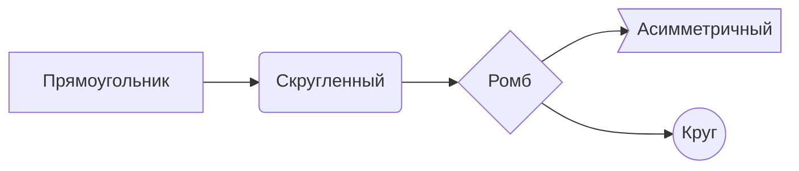
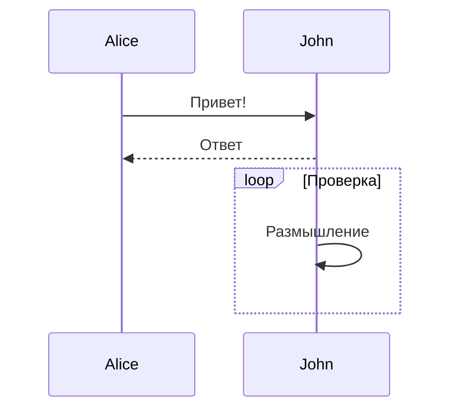
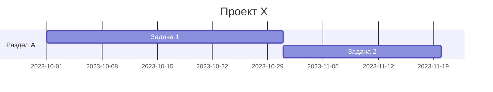
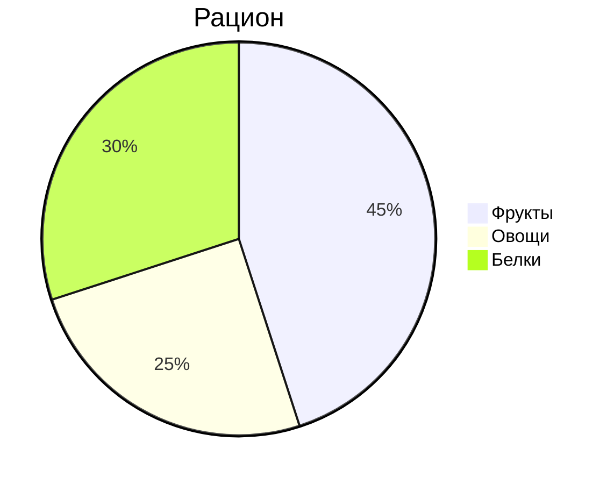
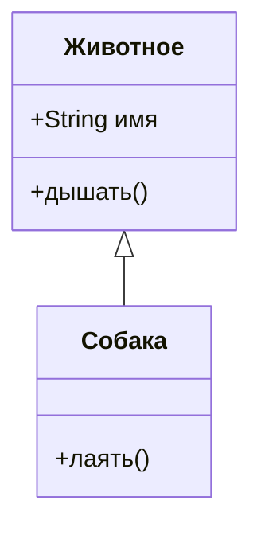
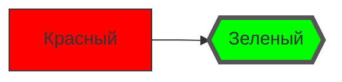
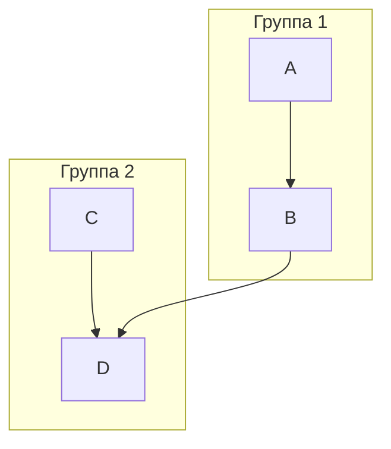
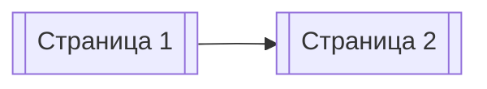
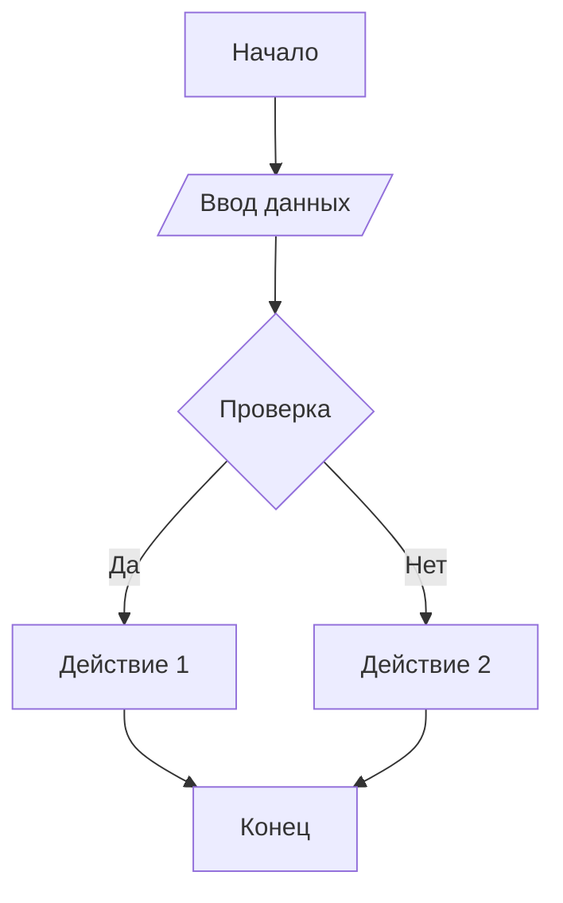

---
tags:
  - obsidian
---

### Создание диаграмм Mermaid в Obsidian: Подробное руководство

Mermaid — это инструмент для создания диаграмм с помощью простого текстового синтаксиса. В Obsidian он встроен по умолчанию, что позволяет визуализировать схемы прямо в заметках. Вот как это работает:

---

#### **1. Базовый синтаксис**
- Используйте блок кода с указанием `mermaid`:
  ````markdown
  ```mermaid
  graph TD
    A[Начало] --> B{Решение}
    B -->|Да| C[Действие 1]
    B -->|Нет| D[Действие 2]
  ```
  ````
- Результат:
  ```mermaid
  graph TD
    A[Начало] --> B{Решение}
    B -->|Да| C[Действие 1]
    B -->|Нет| D[Действие 2]
  ```

---

#### **2. Основные типы диаграмм**
**a) Блок-схемы (Flowcharts)**


**b) Диаграммы последовательности (Sequence)**


**c) Ганта (Gantt)**


**d) Круговые диаграммы (Pie)**


**e) Диаграммы классов (Class)**


---

#### **3. Продвинутые возможности**
**a) Стилизация**


**b) Подграфы (subgraphs)**


**c) Ссылки внутри Obsidian**


---

#### **4. Интеграция с Obsidian**
- **Live Preview**: Диаграммы рендерятся в реальном времени при редактировании.
- **Режим чтения**: Автоматически отображаются как изображения.
- **Копирование как изображение**: ПКМ по диаграмме → *Copy Image*.

---

#### **5. Полезные советы**
1. **Тестирование кода**: Используйте [онлайн-редактор Mermaid](https://mermaid.live/) для проверки синтаксиса.
2. **Ошибки рендеринга**:
   - Проверьте отсутствие лишних пробелов.
   - Убедитесь, что все скобки закрыты.
3. **Плагины**:
   - *Mermaid Tools*: Экспорт в PNG/SVG.
   - *Mermaid Plugin*: Расширенное управление стилями.
4. **Интерактивность**: Добавляйте кликабельные ссылки:
   ```mermaid
   graph LR
     A[[Заметка 1]] -- ссылка --> B{{Заметка 2}}
   ```

---

#### **6. Примеры кода для вставки**
**Блок-схема с решением:**
````markdown

````

**Диаграмма Ганта:**
````markdown

````

---

#### **7. Ограничения**
- Нет поддержки 3D-графики.
- Сложные диаграммы (например, архитектурные схемы) требуют точного синтаксиса.
- Экспорт через плагины (нативный экспорт в Obsidian отсутствует).

Для освоения Mermaid изучите [официальную документацию](https://mermaid.js.org/). Практикуйтесь в Obsidian — это мощный инструмент для визуализации идей!